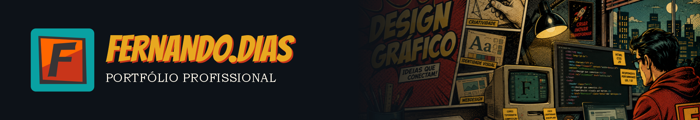
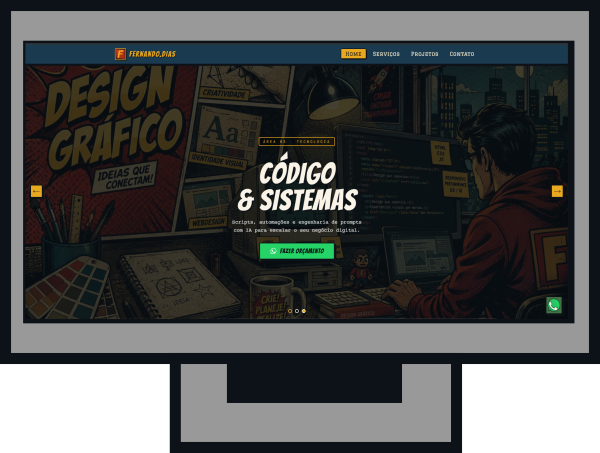

  

Meu site profissional foi criado para apresentar meus projetos e soluções criativas nas áreas de Design Gráfico, Web Design e Desenvolvimento de Códigos & Sistemas, unindo estética, tecnologia e inovação para transformar ideias em experiências digitais impactantes.
Bem-vindo ao meu universo criativo. Este site reúne meus principais projetos em Design Gráfico, Web Design e Desenvolvimento de Sistemas, explorando a conexão entre arte, identidade visual e tecnologia para construir experiências únicas e inovadoras.

## 🚀 Acesse o projeto
Clique no link abaixo para visualizar o site:
[Visitar Site:](https://fernandodiass.com.br/)

## 🛠 Tecnologias utilizadas
O projeto foi desenvolvido utilizando as seguintes tecnologias:

- **HTML5** - Estruturação do conteúdo
- **CSS3** - Estilização e layout responsivo
- **JavaScript** - Interatividade

## 📸 Demonstração

## 👤 Autor

  
  
<strong>Fernando Dias</strong>

  

    <a href="https://github.com/fernandodiass">GitHub</a> | 
    <a href="https://www.linkedin.com/in/fdsdigital">LinkedIn</a>
  

